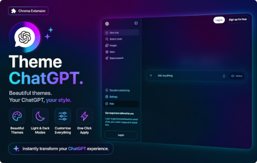
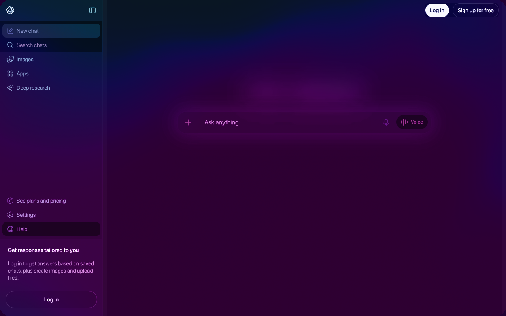
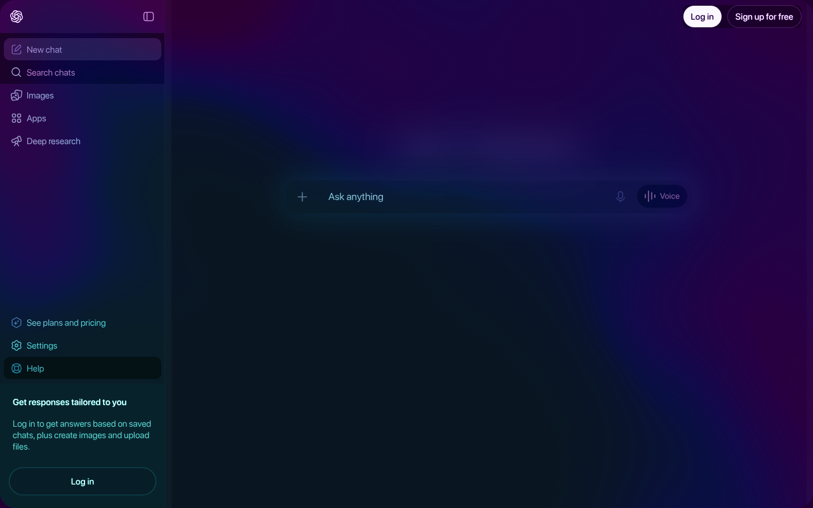

  
  <h1>ChatGPT Gradient Theme</h1>
  
  
<strong>Dark ChatGPT skin with a WebGL gradient backdrop.</strong>

  
Loads on chatgpt.com. Alt+N / Alt+L / Alt+I for chat, sidebar, temp.

  

  
   
  

## Load

1. Open `chrome://extensions`
2. Enable Developer mode
3. Load unpacked → this directory
4. Open [chatgpt.com](https://chatgpt.com)

---

## Shortcuts

| Key     | Action         |
| ------- | -------------- |
| `Alt+N` | New chat       |
| `Alt+L` | Toggle sidebar |
| `Alt+I` | Temporary chat |

---

## Privacy

[`PRIVACY.md`](PRIVACY.md) - no collection, no remote code, chatgpt.com only

## License

[`LICENSE`](LICENSE) - MIT
